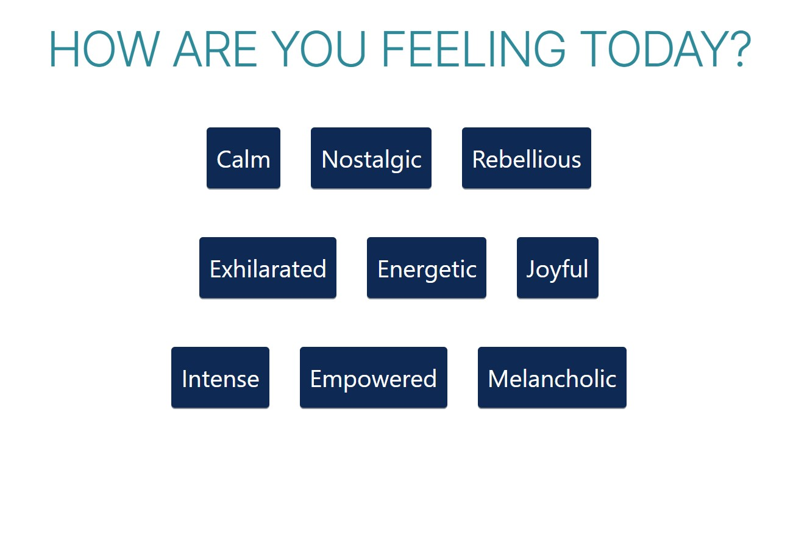
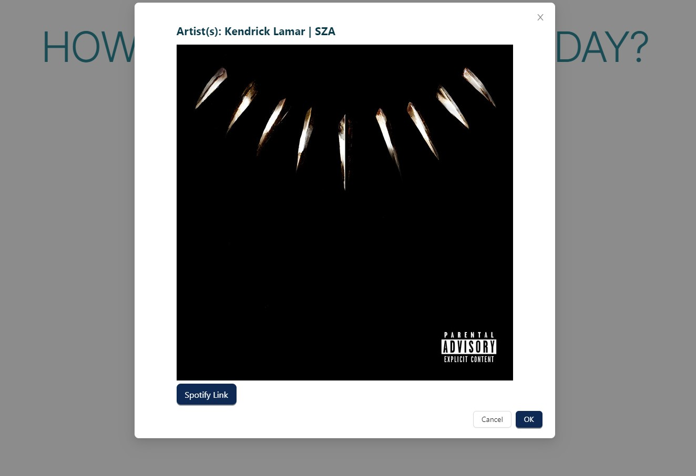

## Mood Mate Web App
Technologies: HTML/CSS, JSON, React, JavaScript, API’s (Spotify API)   
With the use of React, and the Spotify API, this app allows users to generate Spotify albums based on their current mood. This app utilizes user authentication with industry standards such as OAuth

Here is the main page:

Here is an example of the result when a button is clicked:
